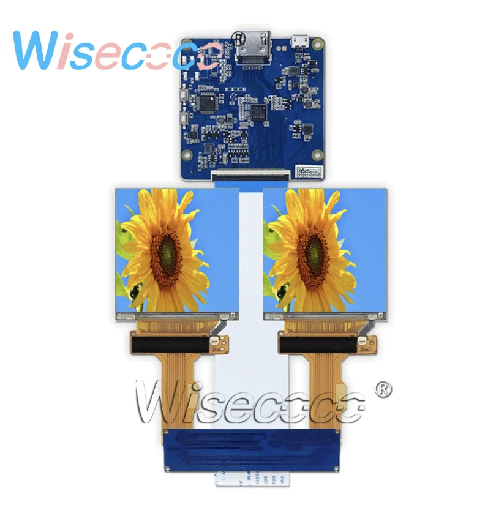
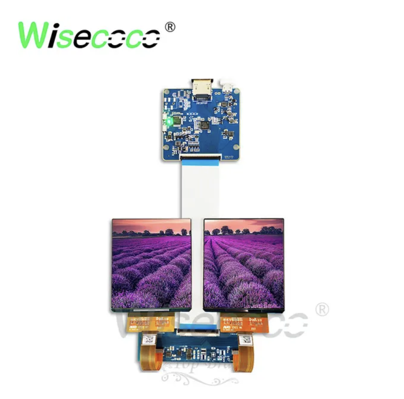
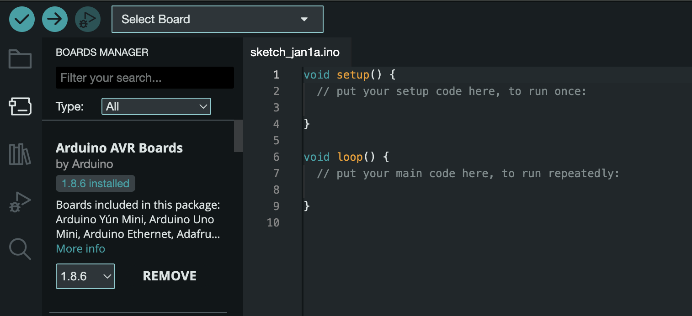
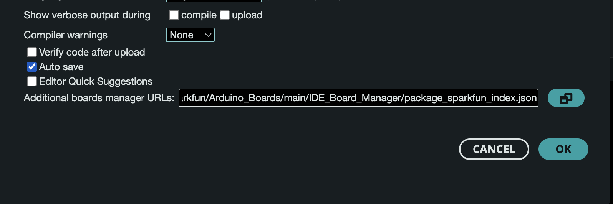
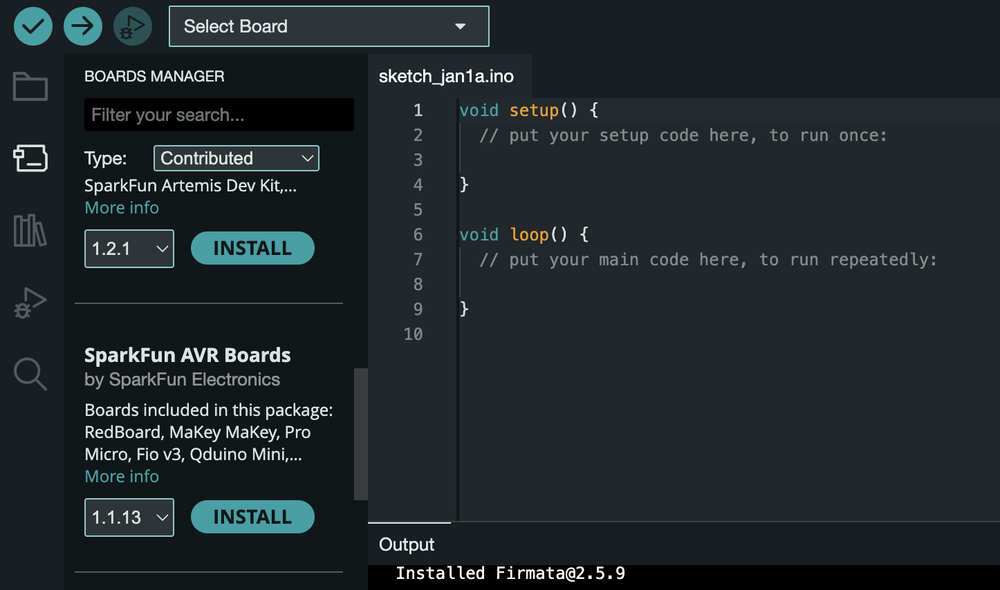
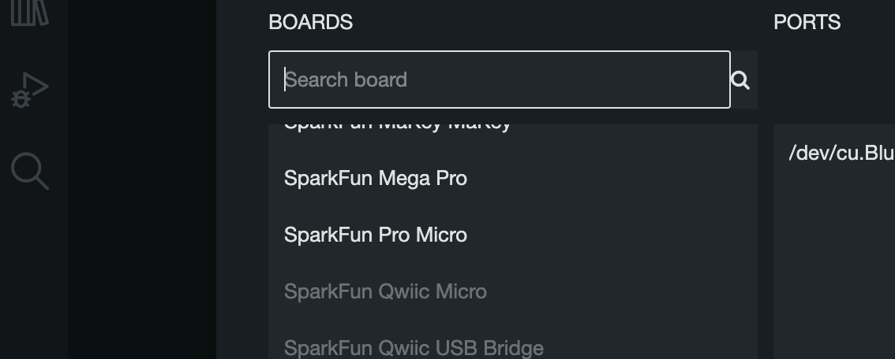
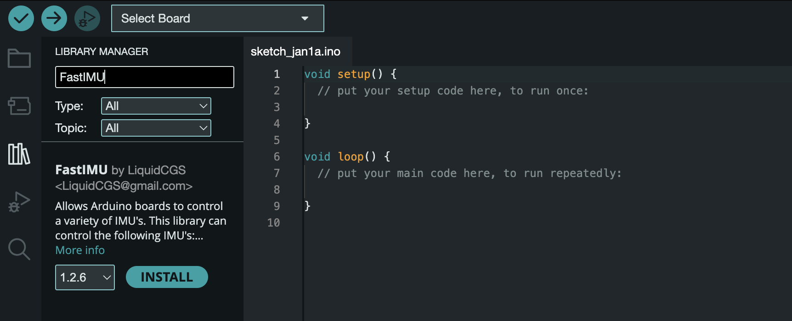
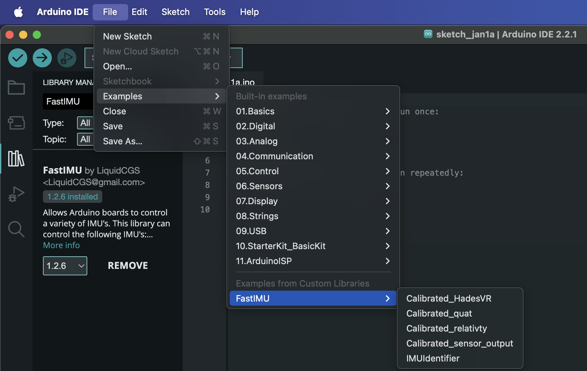

# Building Reality from Scratch

Here's a guide on how to build the Reality from Scratch HMD and controllers with 6DoF tracking. This guide is heavily based off of Relativty and HadesVR's guides, with an emphasis on being beginner-friendly.

## Building the Basic HMD

### Materials

| **Component Type** | **Recommended Part** | **Count** |
| --- | --- | --- |
| IMU | MPU-9250 | 1 |
| MCU | Arduino Pro Micro | 1 |
| Display | 1440x1440 90Hz 2.9" LCDs | 2 |
| Housing | 3D-printed (coming soon) | *varies* |
| Lenses | Fresnel lenses | 2 |

So, a little on our recommendations:

### IMUs and MCUs

The Arduino Pro Micro is a good choice since it supports USB HID. The USB HID class is generally more optimized for smaller, more frequent packets of data vs. serial, which is better for our use since we'll be sending small but very frequent data from our IMU. Other devices, like the Pro Mini and UNO, all use the serial class, which isn't optimal, as we mentioned.

In terms of IMUs; While [FastIMU](https://github.com/LiquidCGS/FastIMU) (what we'll be using to read IMU data) supports the MPU-6050 (which is cheaper), it doesn't include a magnetometer, which could negatively affect overall tracking quality. Given that the MPU-9250 is nearly the same price on AliExpress and Amazon, we figure most people can just purchase the better IMU.

When building Reality from Scratch, we reccommend buying the IMU/MCU first and testing SteamVR output with your monitor's display before buying any more expensive components (for testing purposes). We'll get into the build procedure further down below.

### Displays

In terms of displays, there are two popular options individuals often end up purchasing on AliExpress. This one [(1)](https://www.aliexpress.com/item/1005003041935114.html?spm=a2g0o.productlist.main.1.1d772bcaTyAcB7&algo_pvid=efb5f8ad-1c86-4143-a5a5-f89fa8cfbcf9&algo_exp_id=efb5f8ad-1c86-4143-a5a5-f89fa8cfbcf9-0&pdp_npi=4%40dis%21CAD%21165.17%21135.43%21%21%21118.75%21%21%402101e7f617023300085442577ef149%2112000023407618642%21sea%21CA%212846674746%21&curPageLogUid=faw9rYRIEwGB) is what we picked. It is one of the cheapest displays on the market that has a respectable resolution (1440x1440, akin to a Valve Index) and a refresh rate at 90Hz (unlike the Index's 120Hz).

  
<figcaption><em>Here's what the listing image for this one looks like, complete with the driver board and 2 displays. Usually sells for ~$150 CAD.</em></figcaption>
    

     

  
<figcaption><em>Here's what it looks like in person.</em></figcaption>
    

     

This one [(2)](https://www.aliexpress.com/item/32979565265.html?spm=a2g0o.productlist.main.15.1d772bcaTyAcB7&algo_pvid=efb5f8ad-1c86-4143-a5a5-f89fa8cfbcf9&algo_exp_id=efb5f8ad-1c86-4143-a5a5-f89fa8cfbcf9-7&pdp_npi=4%40dis%21CAD%21113.19%2181.49%21%21%2181.38%21%21%402101e7f617023300085442577ef149%2166830344085%21sea%21CA%212846674746%21&curPageLogUid=IfaiMALuewVh) is a slightly more expensive but also great option that brings OLED to your HMD, meaning better contrast and true blacks. It is at a slightly lower resolution however, coming in at 1080x1200, and it is 3.81 inches (versus the 2.9 inch 1440p display from the first option), bringing its effective sharpness even lower. It does still have 90Hz, though. The specifications are overall very similar to the Oculus CV1's.

  
<figcaption><em>Here's what the listing for the OLED one looks like, with the driver board and 2 displays. This is usually around ~$220 CAD.</em></figcaption>
    

     

The folks over at Smart Prototyping also have a 1440x1600 120Hz display built for Project Northstar (an open-source AR device), which oftentimes can be found for cheaper through B-stock options. Find them [here](https://www.smart-prototyping.com/AR-VR-MR-XR/Display-for-Project-North-Star-3_5inch-1440x1600-pixels%20Promotion%20sale).

You can, of course, purchase any other displays and configure them to your liking. That's what DIY gets you. Just make sure that when purchasing any of these displays, you (1) **purchase both screens and the driver board**, you (2) make sure the driver board has the displays **extend and not duplicate**, and you (3) also **purchase a long, compatible HDMI 2.1 cable and a USB Micro-B to A (or C) cable** for the Arduino. These two cables will be thethering you to your computer, so make sure they're of decent quality as well (watching for durability/flexibility).

### Lenses

In terms of lenses, PMMA plastic (acrylic) fresnels are the easy pick. They are absolutely everywhere, are cheap, and are lighter/more compact than traditional biconvex glass lenses. Since they are everywhere, you can pick a diameter and focal length that you want, and design your housing around those dimensions.

We went with 50mm focal length and 50mm diameter lenses, and they are what our 3D printed design is based around. You could also very well purchase a phone VR kit from Amazon or similar and put in your displays - that would work fine, but you would not know exactly what kind of lenses you are getting. However, some more expensive phone VR models have built-in IPD adjustment, which is very useful.

If you would like to use our 3D printed design, make sure you are using 50mm diameter / 50mm focal length lenses, preferrably biconvex glass (as these are what we designed the housing around, and are thicker than equivalent fresnel lenses). You can find the print design to download in the /prints/ folder (coming very soon).

## Build Guide

We can begin by building out the brains of the HMD. This will take no time and be useful to test the drivers, MCU, and IMU before purchasing and/or putting everything else together. This begins by taking your Arduino Pro Micro and connecting the following 4 pins from your Pro Micro to your IMU using wires to connect to soldered pins, or a breadboard:

> GND $\longleftrightarrow$ GND (Ground)  
> VCC $\longleftrightarrow$ VCC (Voltage)  
> SDA $\longleftrightarrow$ SDA (Serial Data)  
> SCL $\longleftrightarrow$ SCL (Serial Clock)  

 

<em>Example SparkFun Arduino Pro Micro Pinout. GND, VCC, SDA, and SCL must be connected.</em> 

We can now upload the FastIMU firmware to the Arduino Pro Micro. To do this, download/open the Arduino IDE on your PC and connect your Pro Micro using your USB cable. Next, we need to select our board from the dropdown menu located at the top of the IDE.

<em>'Select Board' in the Arduino IDE.</em> 

The exact model name of your MCU varies depending on your board. Some boards will be recognized as a 'Pro Micro' or an 'Arduino Leonardo', but our Arduino Pro Micro was a SparkFun derivative, so we installed the [SparkFun board library](https://learn.sparkfun.com/tutorials/installing-arduino-ide/board-add-ons-with-arduino-board-manager) and found the SparkFun Pro Micro in the dropdown menu.

<em>Installing SparkFun boards: Copy and Paste SparkFun boards URL into 'Additional board manager URLs' (Arduino IDE -> Settings)</em> 

<em>Sort by Type: Contributed in Boards Manager and install 'SparkFun AVR Boards'.</em> 

<em>You can now select the SparkFun Pro Micro in the Arduino IDE.</em> 

This should hopefully have your IDE connected to your Arduino board - but you might want to upload an example sketch to make sure everything is working fine. For our SparkFun Pro Micro derivative board, we had to set the operating voltage to 5V and microcontroller to run at 16MHz first before doing anything else.

Given that, you are now ready to upload the FastIMU firmware.

In order to upload the firmware, you will need the [FastIMU](https://github.com/LiquidCGS/FastIMU/tree/main) library (and the RF24 Arduino Library if you're using HadesVR's HMD PCB with the RF transcievers). You can download these through the Library Manager on the Arduino IDE. 

<em>Search for and download the FastIMU library in the library manager.</em> 

This will have added the example sketches we need. Upload the "Calibrated_HadesVR" or "Calibrated_Relativty" sketch to the Arduino Pro Micro. Calibrate your IMU by following the steps shown in the console.

<em>This is where you can find the example sketches.</em> 

The next step is to allow for your MCU to send data to SteamVR through the drivers. Install the Reality from Scratch drivers by placing the "realityfromscratch" drivers (which you can download [here](/drivers/)) within the SteamVR "drivers" folder (usually located at C:\Program Files (x86)\Steam\steamapps\common\SteamVR\drivers).

Next, open the configuration file (called 'default.vrsettings') for the SteamVR driver - we're going to add the USB PID and VID values of your MCU (as set by Arduino sketch) to the drivers. Make sure the following values are set as such in the file if you uploaded the "Calibrated_Relativty" sketch:

      "hmdPid" : 32823,
      "hmdVid": 9025,

Or if you used the "Calibrated_HadesVR" sketch, make sure they are set as such (our drivers are set to this by default):

      "hmdPid" : 32822,
      "hmdVid": 9025,

If SteamVR fails to pick up your MCU, make sure of your MCU's USB PID and VID values by going into Arduino IDE and selecting Tools -> Get Board Info. This will show your board's PID and VID values in hexadecimal format, so convert them into decimal form and replace the "hmdPid" and "hmdVid" values as needed.

Do not delete any of the commas. Make sure the following is set to false as well:

      "hmdIMUdmpPackets":  false,

If "hmdIMUdmpPackets" is left as 'true', your SteamVR output will go haywire, as the driver will dump random numbers in place of real data from the IMU.

The last thing left to do in the file is to configure your display settings.