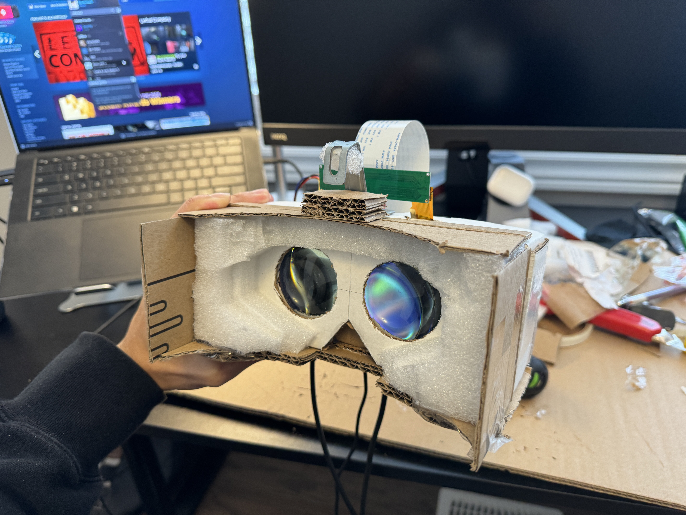
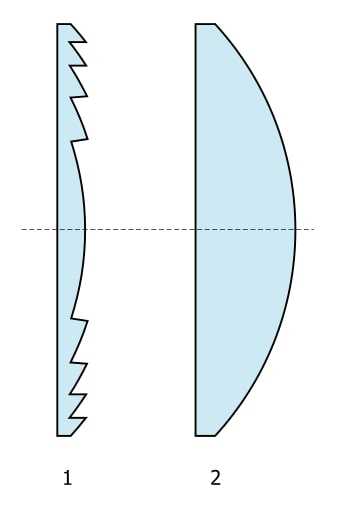
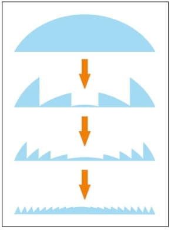

## Overview

Based off of open-source guides, we are building our very own, fully custom VR headset. We call it **Reality from Scratch**.

We first soldered an inertial measurement unit (IMU) and microcontroller unit (MCU) together, and got real-time motion vector data translated into SteamVR with drivers forked from the OpenVR SDK. Then, the VR Compositor output was routed to our VR displays, which comes with accompanying lenses and a custom 3D-printed housing. In addition to the HMD, we are building Vive Wand-style controllers, which we'll dive into deeper below.

From this headset, we plan to build other systems, such as an inside-out 6DoF tracking solution using visual-inertial odometry, or a varifocal optical stack using eye tracking and motors or voice coils.

 

### Basic HMD Hardware

| **Components** | **Our Choice** | **Count** |
| --- | --- | --- |
| IMU | MPU-9250 | 1 |
| MCU | Arduino Pro Micro | 1 |
| Display | 1440x1440 90Hz LCDs | 2 |
| Housing | 3D-printed | *varies* |
| Lenses | $⌀=50mm,$ $f = 50mm$, biconvex, glass | 2 |

### 6DoF Tracking Hardware

| **Components** | **Count** |
| --- | --- |
| PS3 Eye Camera | min 1, max 7 |
| HadesVR/PS3 Move Controllers | 2 |
| USB Hubs | *varies* |

Here's a simple flow chart of how the different components of the VR device interact with each other:

 

### Controllers (coming very soon!)

Our team has received custom PCBs and other various electrical components for the build of 2 DIY Vive Wand-like controllers, which will be based off of [this](https://github.com/HadesVR/Wand-Controller) WIP open-source guide by LiquidCGS (creator of HadesVR). Each controller will have an IMU, a rechargeable battery, RF transceivers, tactile buttons, triggers, and joysticks. The HMD's microcontroller will also be upgraded and moved onto a central PCB. We are almost done with soldering.

 

### Drivers

SteamVR is the only universal platform with accessible driver SDKs (from Valve's OpenVR). It is an easy choice for an open-source VR project. The drivers for Reality from Scratch can be found [here](https://github.com/uwrealitylabs/openvrdriver/tree/main). We use them in conjunction with the FastIMU Arduino library.

### Lenses

We recommend [fresnel](https://xinreality.com/wiki/Fresnel_lens) lenses for any DIY VR build, since they are readily available for very low prices on platforms like Amazon and Aliexpress, and are thin and lightweight. Traditional biconvex lenses are wider, heavier (when built with glass), and usually cost more, but they may have increased visual clarity and no god rays. This is due to the design of fresnels and their fine concentric lines, which can introduce god rays and other distracting artifacts. Below is a visual comparision that should help explain the design of fresnel lenses further.

  
  
   
  <caption><em>Figure 1 (left): Fresnel lens (left) and equivalent power plano-convex lens (right).</em></caption>
     
  <caption><em>Figure 2 (right): Collapsing a conventional lens into an equivalent power Fresnel lens.</em></caption>

Outside of biconvex and fresnel lenses, there are not many options, though there are some advanced [DIY stacked lens](https://hackaday.io/project/187343-easy-pancake-lenses) solutions out in the wild.

A lot of these simpler lenses can be purchased at a wide assortment of focal lengths; we hope to test multiple. Depending on the focal length, the length of the headset's housing will vary, so there may be some merit in seeing the difference between shorter and longer housings (in terms of image quality, FOV, perceived weight of the HMD and how this affects comfort, etc.) Creating the mechanical design for the housing of the VR headset will be challenging, given that we'd like to include user-addressable IPD, as well as test different housing for different lenses. However, we are very excited to begin testing this once we finish modelling the 3D prints for our headset.

## Building your own Reality from Scratch

For a comphrehensive guide on how to build your own Reality from Scratch - our open-source, DIY HMD, check out the guide [here](https://github.com/uwrealitylabs/realityfromscratch/blob/main/Guide.md), or join the UW Reality Labs team if you're a student at the University of Waterloo!

 
<caption><em>work-in-progress HMD module built on HadesVR PCB.</em></caption>
    

     